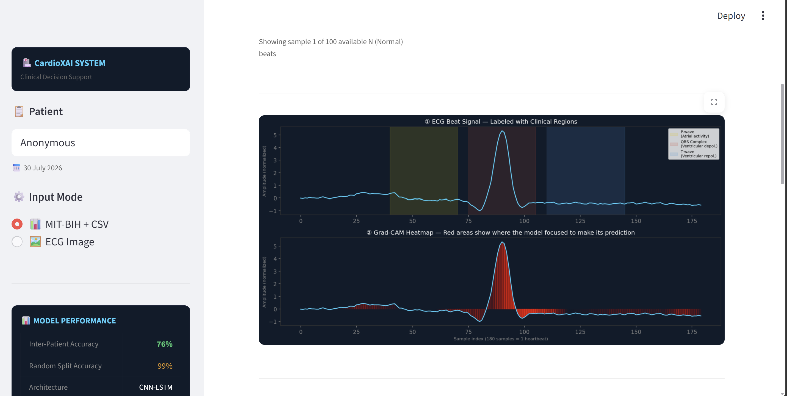

<div align="center">

# CardioXAI

### Explainable CNN-LSTM Framework for Cardiac Arrhythmia Classification

An interpretable deep learning system for ECG arrhythmia detection — built to show not just *what* it predicts, but *why*, using Grad-CAM attention over clinically meaningful ECG regions (P-wave, QRS complex, T-wave).

[](https://www.python.org/)
[](https://www.tensorflow.org/)
[](https://streamlit.io/)
[](LICENSE)

[Live Demo](#) · [Report a Bug](../../issues) · [Request a Feature](../../issues)

</div>

---

## Overview

CardioXAI classifies cardiac arrhythmias from ECG signals using a hybrid **CNN-LSTM** architecture trained on the **MIT-BIH Arrhythmia Database**, and explains every prediction with **Grad-CAM** — highlighting exactly which part of the heartbeat (P-wave, QRS complex, or T-wave) the model relied on.

Most arrhythmia classifiers are black boxes. CardioXAI is built around the opposite premise: a clinical decision support tool is only useful if a clinician can see *why* the model reached its conclusion. Every prediction ships with a region-level attention breakdown and a downloadable clinical report.

<div align="center">
<!-- Replace with an actual screenshot or GIF of the app -->

</div>

## Key features

- **Three input modes** — browse the MIT-BIH database directly, upload a segmented ECG beat as CSV, or upload a raw ECG image/photo for automatic digitization
- **ECG image digitization** — extracts a clean digital signal from a scanned or photographed ECG strip, detects R-peaks, and segments individual heartbeats
- **Explainable predictions** — Grad-CAM heatmaps mapped to clinically labeled regions (P-wave / QRS complex / T-wave), not just a raw saliency map
- **Inter-patient evaluation** — reports both random-split and inter-patient split accuracy, directly addressing the generalization gap that inflates accuracy claims in most published ECG classifiers
- **Clinical report generation** — one-click PDF export with prediction, confidence, region attention, and risk classification
- **Literature benchmarking** — built-in comparison against results reported in recent peer-reviewed work on the same task

## Results

| Evaluation protocol | Accuracy | What it measures |
|---|---|---|
| Random split | `XX%` | Standard train/test split — beats from the same patient can appear in both sets |
| **Inter-patient split** | `XX%` | Patients in the test set are unseen during training — the harder, more clinically realistic benchmark |

> The gap between these two numbers is reported deliberately. Random-split accuracy is the figure most commonly cited in ECG classification papers, but it overstates real-world performance because it leaks patient-specific signal characteristics between train and test sets. Inter-patient evaluation is closer to how the model would perform on a genuinely new patient.

<details>
<summary><b>Confusion matrix and per-class breakdown</b></summary>
<br>
<!-- Insert confusion matrix image or table here -->
</details>

## How it works

```
┌─────────────────┐     ┌──────────────────┐     ┌─────────────────┐
│   Input signal   │ ──▶ │   CNN-LSTM model   │ ──▶ │   Prediction     │
│ (DB / CSV / image)│     │  (feature extract  │     │ + confidence     │
└─────────────────┘     │   + temporal model) │     └─────────────────┘
                          └──────────────────┘               │
                                                               ▼
                                                     ┌──────────────────┐
                                                     │     Grad-CAM      │
                                                     │  region attention │
                                                     └──────────────────┘
```

1. **Signal acquisition** — a heartbeat is sourced from the MIT-BIH database, a pre-segmented CSV, or digitized from an ECG image (grid removal → lead extraction → R-peak detection → beat segmentation)
2. **Classification** — a CNN extracts local morphological features from the 180-sample beat; an LSTM models temporal dependencies across the sequence
3. **Explanation** — Grad-CAM produces a per-sample attention map over the beat, which is aggregated into P-wave / QRS / T-wave attention scores
4. **Reporting** — prediction, confidence, risk level, and attention breakdown are compiled into a downloadable clinical PDF

## Tech stack

| Layer | Technology |
|---|---|
| Model | TensorFlow / Keras (CNN-LSTM) |
| Explainability | Grad-CAM |
| App interface | Streamlit |
| Signal processing | NumPy, SciPy |
| Image digitization | OpenCV, pytesseract |
| Report generation | ReportLab |
| Evaluation | scikit-learn |
| Dataset | [MIT-BIH Arrhythmia Database](https://physionet.org/content/mitdb/) (PhysioNet) |

## Arrhythmia classes

| Code | Class | Clinical significance |
|---|---|---|
| `N` | Normal sinus rhythm | Baseline / no arrhythmia detected |
| `A` | Atrial premature contraction | Ectopic beat originating in the atria |
| `V` | Ventricular premature contraction | Ectopic beat originating in the ventricles — highest risk category |
| `L` | Left bundle branch block | Delayed conduction through the left bundle |
| `R` | Right bundle branch block | Delayed conduction through the right bundle |

## Getting started

### Prerequisites

- Python 3.10+
- [Tesseract OCR](https://github.com/tesseract-ocr/tesseract) installed and on your system `PATH` (used for optional patient-name detection from uploaded ECG images)

### Installation

```bash
git clone https://github.com/<your-username>/cardioxai.git
cd cardioxai
python -m venv venv
source venv/bin/activate   # Windows: venv\Scripts\activate
pip install -r requirements.txt
```

### Run locally

```bash
streamlit run app.py
```

The app will be available at `http://localhost:8501`.

## Project structure

```
cardioxai/
├── app.py                  # Streamlit application entry point
├── gradcam.py               # Grad-CAM implementation
├── ecg_digitizer.py         # ECG image → signal extraction pipeline
├── evaluation.py            # Literature comparison + evaluation utilities
├── ecg_cnn_lstm_model.keras # Trained CNN-LSTM model weights
├── beats.npy                 # Preprocessed MIT-BIH beat segments
├── labels.npy                 # Corresponding class labels
├── label_encoder.pkl         # Label encoder for class names
├── requirements.txt
└── .streamlit/
    └── config.toml           # App theme configuration
```

## Research context

This project was developed as a final-year research project investigating explainable deep learning for cardiac arrhythmia classification, with a specific focus on the **inter-patient generalization problem** — the gap between reported and real-world performance in ECG classifiers evaluated only with random data splits.

<!-- Add citation block here once published -->

## Limitations and disclaimer

This is a research prototype, **not a certified diagnostic tool**. Predictions are not validated for clinical use and should never substitute professional medical judgment. All outputs are intended for research and educational purposes only.

## License

Distributed under the MIT License. See [`LICENSE`](LICENSE) for details.

## Acknowledgements

- [MIT-BIH Arrhythmia Database](https://physionet.org/content/mitdb/) — Moody GB, Mark RG. *The impact of the MIT-BIH Arrhythmia Database.* IEEE Eng in Med and Biol 20(3):45-50 (2001)
- [PhysioNet](https://physionet.org/) for hosting and maintaining the dataset

